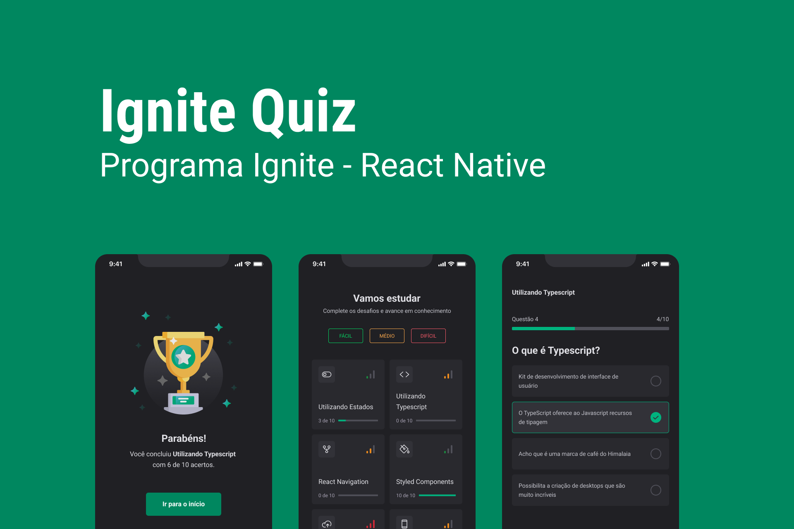
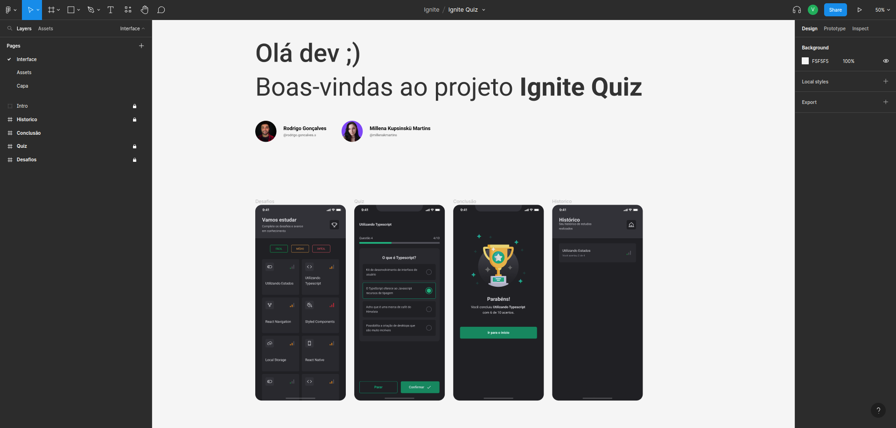

<h1 align="center">
   Ignite Quiz
</h1>

<p align="center">


</p>

---

<p align="center">
  <a href="#-projeto">Projeto</a>&nbsp;&nbsp;&nbsp;|&nbsp;&nbsp;&nbsp;
  <a href="#-como-rodar-o-projeto">Como rodar o projeto</a>&nbsp;&nbsp;&nbsp;|&nbsp;&nbsp;&nbsp;
  <a href="#-tecnologias">Tecnologias</a>&nbsp;&nbsp;&nbsp;|&nbsp;&nbsp;&nbsp;
  <a href="#-layout">Layout</a>&nbsp;&nbsp;&nbsp;|&nbsp;&nbsp;&nbsp;
  <a href="#-licença">Licença</a>
</p>

## 💻 Projeto

O **Ignite Quiz Mobile** é um projeto desenvolvido utilizando React Native e Expo, criado para proporcionar aos usuários um aplicativo de perguntas sobre programação. O app apresenta animações e microinterações especiais, utilizando as bibliotecas Expo AV, Expo Haptics, React Native Reanimated e React Native Skia.

### Funcionalidades Principais

- [x] Filtrar Quizzes por dificuldades (fácil, médio, difícil)
- [x] Realizar Quiz
- [x] Pular pergunta do quiz
- [x] Acessar histórico dos quizzes realizados
- [x] Excluir item do histórico
- [x] Feedback sonoro ao responder questão

### Descrição

O **Ignite Quiz Mobile** é um aplicativo móvel que oferece aos usuários uma plataforma de perguntas sobre programação. Seu objetivo é proporcionar uma experiência envolvente e interativa para testar o conhecimento dos usuários.

O aplicativo foi desenvolvido utilizando a combinação poderosa do React Native e Expo, permitindo uma ampla compatibilidade com dispositivos móveis iOS e Android.

**Principais Características:**

1. **Filtrar Quizzes por dificuldades:** Os usuários podem filtrar os quizzes de acordo com a dificuldade desejada. As opções incluem fácil, médio e difícil, permitindo que os usuários escolham um nível adequado ao seu conhecimento e desafio.

2. **Realizar Quiz:** Os usuários podem participar de quizzes interativos sobre programação. Cada pergunta é cuidadosamente apresentada, permitindo que os usuários selecionem a resposta correta entre as opções fornecidas.

3. **Pular pergunta do quiz:** Caso os usuários encontrem uma pergunta desafiadora ou queiram voltar a ela posteriormente, eles têm a opção de pular para a próxima pergunta. Essa funcionalidade proporciona flexibilidade durante o processo de resposta.

4. **Acessar histórico dos quizzes realizados:** O aplicativo mantém um histórico dos quizzes realizados pelos usuários. Isso permite que os usuários vejam os resultados anteriores, acompanhem seu progresso ao longo do tempo e revivam as conquistas passadas.

5. **Excluir item do histórico:** Se os usuários desejarem limpar o histórico ou remover um quiz específico, o aplicativo oferece a opção de excluir itens do histórico, garantindo uma experiência personalizada.

6. **Feedback sonoro ao responder questão:** Ao responder uma pergunta, o aplicativo fornece feedback sonoro imediato, indicando se a resposta está correta ou incorreta. Esses sons enriquecem a experiência do usuário e fornecem uma sensação de satisfação ao responder corretamente.

O **Ignite Quiz Mobile** é um aplicativo cativante e interativo, ideal para aqueles que desejam testar seus conhecimentos em programação. Com suas animações e microinterações personalizadas, o aplicativo oferece uma experiência agradável e envolvente, incentivando os usuários a aprenderem e se desafiarem em um ambiente descontraído e amigável.

## 📹 Vídeos

### Realização Quiz

https://github.com/vitorsemidio-dev/ignitequiz/assets/52754546/94ffb0a8-a11b-4e32-abc6-7242e0538190

### Exclusão item do histórico

https://github.com/vitorsemidio-dev/ignitequiz/assets/52754546/0346a052-217d-44dc-9693-31764d297cac

## 🧭 Como rodar o projeto

### 🚨 Requisitos

**Instalação aplicativo do Expo no smartphone**

- [Expo Android](https://play.google.com/store/apps/details?id=host.exp.exponent&hl=pt_BR&gl=US) ou [Expo iOS](https://apps.apple.com/us/app/expo-go/id982107779)

**Clone este repositório**

**Acesse a pasta**

**Instale as dependências e inicie o projeto**

```bash
npm install
```

```bash
npx expo start
```

**Abra o projeto no dispositivo**

Abra o aplicativo do Expo no smartphone, aponte a câmera para o QRCode que apareceu no terminal após executar o comando `npx expo start`.

**Importante**: _O dispositivo móvel e o computador precisam estar na mesma rede_


## 🚀 Tecnologias

Esse projeto foi desenvolvido com as seguintes tecnologias:

- [Expo](https://expo.dev/)
- [Expo AV](https://docs.expo.dev/versions/latest/sdk/av/)
- [Expo Haptics](https://docs.expo.dev/versions/latest/sdk/haptics/)
- [React Native Reanimated](https://docs.swmansion.com/react-native-reanimated/)
- [React Native Skia](https://shopify.github.io/react-native-skia/)
- [TypeScript](https://www.typescriptlang.org/pt/)

## 🔖 Layout

Você pode visualizar o layout do projeto através [deste link](https://www.figma.com/file/Is4Ep1u1Lyp1VUWLIN8Rmn/Ignite-Quiz).

<a href="https://www.figma.com/file/Is4Ep1u1Lyp1VUWLIN8Rmn/Ignite-Quiz">
  
</a>

## 📝 Licença

Esse projeto está sob a licença MIT. Veja o arquivo [LICENSE](LICENSE) para mais detalhes.
